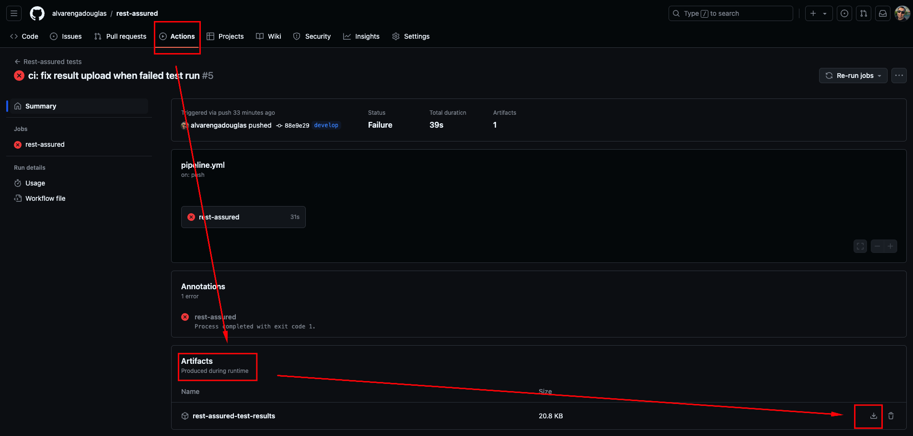

<p align="center">
  <a href="https://unform.dev">
    
  </a>
</p>

<p align="center">Testar e validar serviços REST em Java é mais difícil do que em linguagens dinâmicas como Ruby e Groovy! 🚀</p>

## Tecnologias
<div align="center">

Esse projeto foi construído com as seguintes tecnologias.

[](https://www.oracle.com/br/java/technologies/javase/jdk11-archive-downloads.html)<space><space>
[](https://rest-assured.io/)<space><space>


</div>

## Sobre o projeto

Esse é um projeto básico de testes de API com rest assured integrado a um pipeline de CI do GitHub Actions.

Ao rodar o pipeline você terá as seguintes etapas:
- Checkout do código fonte.
- Configuração do ambiente.
- Execução dos tests.
- Disponibilização do relatório como artefato no GitHub.

## Arquitetura:

```
├── README.md
├── pom.xml                         # Arquivo de configuração do Maven
├── .github/workflows/pipeline.yaml # Pipeline de CI/CD configurado para o GitHub Actions
├── assets                          # Arquivos de imagem para documentação
│   └── imagens                     # Imagens utilizadas no README.md
├── src
│   └── test                        # Diretório para os testes e recursos de teste
│       ├── java
│       │   ├── config              # Configurações do projeto
│       │   │   └── Configuracoes.java   # Classe para configuração geral do projeto
│       │   ├── enums               # Enumerações usadas no projeto
│       │   │   ├── PayloadPaths.java    # Enum com caminhos dos payloads
│       │   ├── factory             # Fábrica para criação de objetos (POJOs)
│       │   │   └── PojoFactory.java      # Classe para criar instâncias de POJOs usados nos testes
│       │   ├── pojo                # Objetos de transferência de dados
│       │   │   ├── Login.java           # Classe POJO para dados de login
│       │   │   └── UpdateProducts.java  # Classe POJO para dados de atualização de produtos
│       │   ├── tests               # Pacote principal para testes
│       │   │   ├── products             # Testes relacionados a produtos
│       │   │   │   ├── DeleteProductTest.java # Teste para exclusão de produtos
│       │   │   │   ├── GetProductsTest.java   # Teste para obtenção de produtos
│       │   │   │   └── UpdateProductTest.java # Teste para atualização de produtos
│       │   │   └── LoginTest.java             # Teste para o fluxo de login
│       │   ├── util                # Utilitários e classes de suporte
│       │   │   ├── BaseTest.java        # Classe base para configuração de testes
│       │   │   ├── Logs.java            # Classe para manipulação de logs
│       │   │   └── RequestInteraction.java # Classe para interações com a API
│       └── resources               # Recursos adicionais para os testes
│           ├── payloads            # Payloads JSON para os testes
│           │   └── arquivos json        # Arquivos JSON com payloads
│           └── schemas             # Esquemas para validação de JSON
│               └── arquivos json        # Arquivos JSON com schemas

```

### Detalhamento dos pacotes e classes
#### config: 
Contém classes de configuração que centralizam as variáveis de ambiente e parâmetros necessários para a execução dos testes, como Configuracoes.java.

#### enums: 
Armazena enums que facilitam a organização e reutilização de constantes, como PayloadPaths.java, que contém caminhos para os payloads usados nos testes.

#### factory: 
Fornece uma classe de fábrica, PojoFactory.java, responsável por criar instâncias de objetos (POJOs) usados nos testes, facilitando a geração de dados para os cenários de teste.

#### pojo:
Contém os POJOs (Plain Old Java Objects) que representam modelos de dados, como Login.java e UpdateProducts.java. Esses objetos simplificam o manuseio de dados estruturados dentro dos testes.

#### tests: 
Pacote principal para os testes automatizados.

#### products: 
Agrupa testes relacionados a operações de produto, como criação, atualização e exclusão de produtos.

#### LoginTest.java:
Teste específico para o fluxo de login do sistema.

#### util:
Pacote com classes utilitárias usadas para suportar os testes.

#### BaseTest.java: 
Classe abstrata que configura o ambiente comum para todos os testes.

#### Logs.java: 
Classe para manipulação e configuração de logs.

#### RequestInteraction.java: 
Interface responsável pelas interações com a API, facilitando a construção e execução de requisições.

#### resources:
Contém arquivos externos e recursos usados nos testes.

#### payloads:
Diretório que armazena os arquivos JSON usados como payloads nos testes de API.

#### schemas:
Diretório para esquemas JSON, usados para validar as respostas das APIs.


## Relatório:
O relatório é disponibilizado após o run da pipeline, falhando ou passando.


<div align="center">

#### Análise do relatório
</div>


Esse projeto conta com o relatório do [Extent Report](https://extentreports.com/docs/versions/5/java/index.html) na versão 5.

- Cada classe de teste irá gerar um relatório em: /target/Reports
- O relatório é gerado com o mesmo nome de cada classe de teste.
- O relatório é estruturado em: dados enviados, dados retornados e validações relizadas.


## Rodando local:
Para rodar local você vai precisar ter configurado:
- Java
- Maven

Rode o seguinte comando no terminal:
`mvn clean test`

